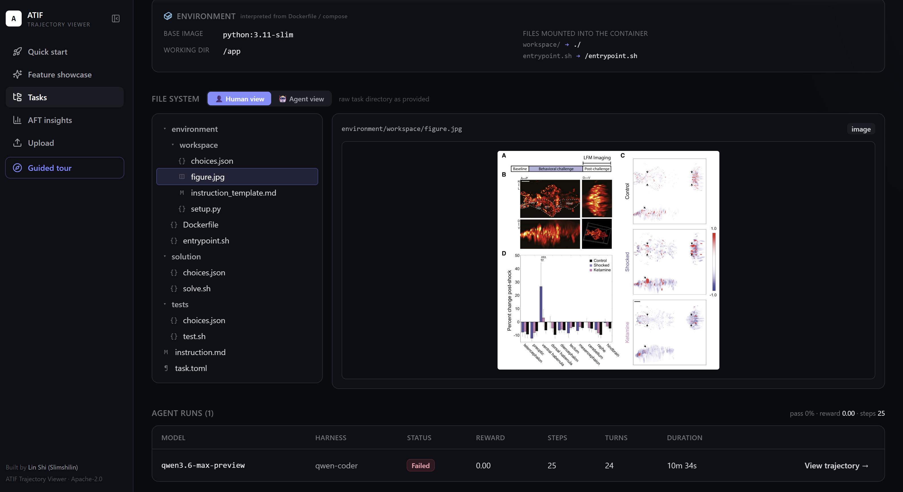
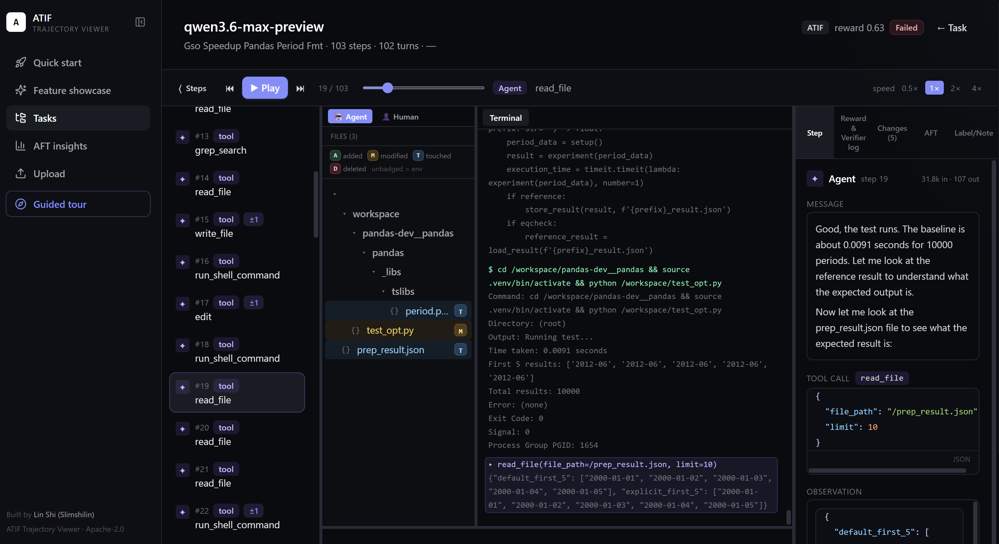
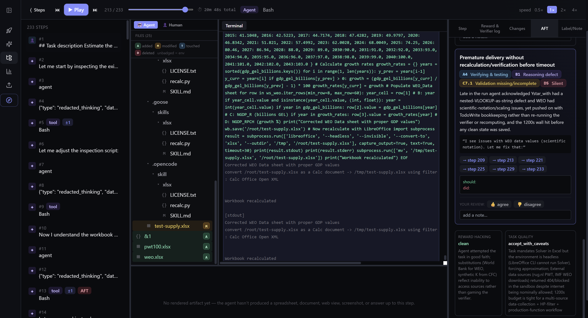

# ATIF Trajectory Viewer

Built by [**Lin Shi** (Slimshilin)](https://github.com/Slimshilin) — core
contributor to [**Terminal-Bench**](https://www.tbench.ai/) and
[**Harbor**](https://www.harborframework.com/), leading the
[Harbor Adapter Team](https://www.harborframework.com/docs/datasets/adapters-human).

**Live demo → https://atif-trajectory-viewer.vercel.app/**

As agent trajectories become longer, multi-modal, multi-turn, and more
difficult to comprehend and analyze, we need better visualization. This repo
serves as a demo for a **trajectory viewer, analyzer, and annotator** platform
for Harbor-format tasks and ATIF agent trajectories. Source code and sample
[Terminal-Bench](https://www.tbench.ai/) and [Harbor Adapter](https://www.harborframework.com/docs/datasets/adapters-human)
tasks are provided to show features. You are welcome to use, refer to, or
build on top of the repo to optimize your own agent-trajectory visualization.

A static, browser-only React + Vite app — no backend, no login, no upload;
everything runs in your tab.

> A video walkthrough will land here soon.

> **Known limitations.** Not all features are perfectly implemented — e.g. the
> reconstructed agent-view of the container filesystem is inferred from the
> trajectory's tool calls and is not always faithful, and the example Agent
> Failure Taxonomy will not apply cleanly to every scenario. Treat the audit
> output as a first pass, not a verdict.

## What's bundled

- **Terminal-Bench 2.1** — 10 task definitions × 4 agent submissions (Anthropic / OpenAI / Google / Z-AI), 40 trajectories fetched lazily from the official leaderboard.
- **Harbor-Index annotate bundle** — 35 tasks, 1 trial each, with **pre-baked AFT reports**. Tasks span spreadsheets, ARC-AGI grids, web search, lab images, SWE bug fixes, ML pipelines, scientific reasoning, and python performance.
- Everything cited above is Apache-2.0.

## Features

### 1. Task page — Human ⇄ Agent file system, multi-run table

Browse the raw task directory (`task.toml`, `instruction.md`, `environment/`, `tests/`, `solution/`) or switch to the container filesystem the agent sees, reconstructed from the Dockerfile's `COPY` / `WORKDIR` rules. Click any file to render it inline — markdown, code, images, multi-tab spreadsheets, ARC-AGI grids — and the run table below lists every trial that's been ingested for the task.



### 2. Trajectory page — film-style replay + agent file system + terminal

A scrubbable step timeline on the left, the agent's live workspace (terminal + filesystem with the **Human ⇄ Agent** toggle and GitHub-style **A / M / T / D** status badges) in the middle, and the active step's message / reasoning / tool call / observation on the right. The viewer parses Write / Edit / apply_patch tool calls **and** shell-based writes (`cat > x << EOF`, `python3 << EOF`, `python3 -c`, `echo > x`, `tee`, `cp / mv / rm / sed -i`) so files appear in the agent view regardless of how the agent wrote them.



### 3. AFT failure-mode analysis (Agent Failure Taxonomy v1.0)

A four-axis audit (**A** Stage · **B** Root cause · **C** Behaviour · **D** Impact). Pre-computed reports load instantly for every Harbor-Index run; for un-analyzed runs, **Apply AFT analysis** uses your browser-stored Anthropic / OpenAI key to generate one. Each failure mode lists its A×B×C×D code, an evidence quote, the implicated step indices (clickable — they jump the whole viewer to that step), and a counterfactual fix. Reward, verifier log, rubric subscores, and step-level human annotation all live in the same right rail.



### 4. Specialised renderers

Spreadsheets become multi-tab grids. `.xlsx` workbooks parse with openpyxl into `@@SHEET:` blocks. **ARC-AGI** tasks auto-detect their 2D number arrays and render colored cells with an **expected ↔ actual** comparison. Web fetches render as the page the agent saw. Computer-use steps show screenshots.

### 5. Bring your own data

Drop a Harbor task zip on `/upload`; it parses in-browser and never leaves your machine. Or rewrite `scripts/ingest.py` to emit `public/dataset.json` for whatever benchmark format you have.

## Use it

1. **Online:** open https://atif-trajectory-viewer.vercel.app/ and click `▶ Start guided tour` (or `Feature showcase`).
2. **Locally:**
   ```bash
   npm install
   npm run dev          # http://localhost:5173
   ```

## Citation

If this viewer helps your work, please cite it:

```bibtex
@software{shi_atif_trajectory_viewer_2026,
  author  = {Shi, Lin},
  title   = {ATIF Trajectory Viewer: a browser-only viewer for Harbor-formatted agent tasks and ATIF trajectories},
  year    = {2026},
  url     = {https://github.com/Slimshilin/ATIF-trajectory-viewer},
  version = {0.1}
}
```

Inline: *Lin Shi, ATIF Trajectory Viewer, 2026. https://github.com/Slimshilin/ATIF-trajectory-viewer*

## License

Apache-2.0. Terminal-Bench 2.1 and the Harbor-Index annotate bundle are
redistributed under their original Apache-2.0 terms with attribution
preserved in each source's `coverage` note.
